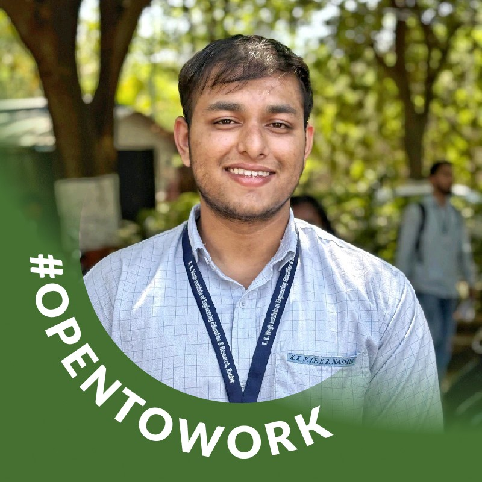
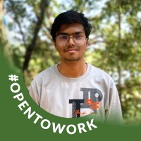

<p align="center">
  
</p>

<h1 align="center">🛡️ Kumbh Kavach</h1>

<p align="center">
  <strong>A Family Connectivity Wristband for Safer Mass Gatherings</strong>
</p>

<p align="center">
  <em>When crowds rise, networks fail, and panic spreads — Kumbh Kavach keeps families connected and emergencies visible.</em>
</p>

<p align="center">
  <a href="#-about">About</a> •
  <a href="#-problem-statement">Problem</a> •
  <a href="#-solution">Solution</a> •
  <a href="#-features">Features</a> •
  <a href="#-architecture">Architecture</a> •
  <a href="#-tech-stack">Tech Stack</a> •
  <a href="#-getting-started">Getting Started</a> •
  <a href="#-team">Team</a>
</p>

<p align="center">
  
  
  
  
  
</p>

---

## 📖 About

**Kumbh Kavach** is a comprehensive wearable health and safety ecosystem specifically designed for large-scale gatherings like **Kumbh Mela** — the world's largest religious congregation with over 100 million attendees. 

The project addresses critical challenges faced during mass events:
- Mobile network congestion and failure
- Family member separation in dense crowds
- Delayed medical emergency response
- Lack of real-time health monitoring

Our solution combines a **low-cost sensor-based wristband** with a **companion Android dashboard** to provide continuous vital monitoring, automatic fall detection, and instant emergency alerts — all designed to work reliably even when traditional networks fail.

---

## 🔴 Problem Statement

> **"In a crowd of millions, separation happens in seconds."**

At large-scale events like Kumbh Mela, critical safety challenges emerge:

| Challenge | Impact |
|-----------|--------|
| **Network Overload** | Mobile networks collapse under 100M+ users, cutting off communication |
| **Family Separation** | Children, elderly, and disabled individuals get lost in dense crowds |
| **Medical Delays** | Health emergencies go unnoticed; help arrives too late |
| **Panic Escalation** | Small incidents become major crises due to lack of real-time information |
| **No Visibility** | Families have no way to monitor vulnerable members' safety status |

Traditional solutions like phone calls, SMS, or GPS trackers fail when:
- Cell towers are overloaded
- Battery runs out quickly on smartphones
- Internet connectivity is unavailable
- Devices are too complex for elderly users

---

## ✅ Solution

> **"One wristband. One ecosystem. Real safety."**

Kumbh Kavach provides a **three-layer safety solution**:

### 🎯 Wearable Band
A lightweight, water-resistant wristband that:
- Continuously monitors heart rate, SpO₂, and body temperature
- Detects falls and sudden impacts automatically
- Features a one-press SOS button for emergencies
- Communicates via Bluetooth Low Energy (power-efficient, no network needed)
- Runs 8-10 hours on a single charge

### 📱 Mobile Dashboard
An Android companion app that:
- Displays real-time vitals with visual graphs
- Shows alert thresholds with color-coded warnings
- Stores data offline when connectivity is poor
- Sends instant notifications for SOS and anomalies
- Supports family group monitoring

### 🚨 Emergency Response Layer
A rapid-response system that:
- Immediately notifies family contacts on SOS trigger
- Shares last known vital readings with emergency info
- Works without internet via BLE mesh (future scope)
- Integrates with event medical teams (planned)

---

## ✨ Features

### Core Capabilities

| Feature | Description | Hardware/Tech |
|---------|-------------|---------------|
| ❤️ **Real-Time Heart Rate & SpO₂** | Continuous optical sensing using PPG for early warning of cardiac stress or oxygen drops | MAX30102 Sensor |
| 🌡️ **Body Temperature Tracking** | Detect fever spikes, heat exhaustion, or hypothermia in real-time | DS18B20 Sensor |
| 🏃 **Fall & Motion Detection** | 6-axis accelerometer + gyroscope recognizes sudden impacts and triggers alerts | MPU6050 IMU |
| 🆘 **Instant SOS Trigger** | Physical button sends high-priority alert with latest vitals to all connected devices | Hardware Button |
| 📶 **BLE Communication** | Low-power, reliable short-range data transfer; works without cellular network | ESP32 BLE Stack |
| 💾 **Offline-First Design** | Data cached locally using Room DB; syncs automatically when connectivity returns | Android Room |
| 🔋 **8-10 Hour Battery Life** | Deep sleep modes, optimized sampling rates, efficient firmware design | ESP32 Power Mgmt |
| 👨‍👩‍👧‍👦 **Family Mode** | Link multiple bands to one dashboard; monitor elderly parents and children together | Multi-device BLE |

### Dashboard Features

- **Live Vital Charts** — Real-time graphs for HR, SpO₂, temperature
- **Alert Thresholds** — Customizable limits with color-coded warnings (green/yellow/red)
- **Historical Data** — View trends over time to spot patterns
- **Quick Actions** — One-tap SOS, call emergency contacts, share location
- **Dark Mode UI** — Easy visibility in bright outdoor conditions

---

## 🏗️ Architecture

```
┌─────────────────────────────────────────────────────────────────────────────┐
│                              SENSOR LAYER                                   │
│  ┌─────────────┐   ┌─────────────┐   ┌─────────────┐   ┌─────────────┐     │
│  │  MAX30102   │   │  DS18B20    │   │  MPU6050    │   │  SOS Button │     │
│  │  HR + SpO₂  │   │ Temperature │   │Fall Detect  │   │  Physical   │     │
│  └──────┬──────┘   └──────┬──────┘   └──────┬──────┘   └──────┬──────┘     │
└─────────┼─────────────────┼─────────────────┼─────────────────┼─────────────┘
          │                 │                 │                 │
          └────────────────┬┴────────────────┬┴─────────────────┘
                           ▼                 
┌─────────────────────────────────────────────────────────────────────────────┐
│                           PROCESSING LAYER                                  │
│                         ESP32-WROOM-32 MCU                                  │
│  ┌─────────────────────────────────────────────────────────────────────┐   │
│  │  • Signal Acquisition & Filtering    • Threshold Detection         │   │
│  │  • Moving Average Smoothing          • Fall Algorithm (Free-fall   │   │
│  │  • Data Packaging (JSON/Binary)        + Impact + Orientation)     │   │
│  │  • Power Management (Deep Sleep)     • SOS State Machine           │   │
│  └─────────────────────────────────────────────────────────────────────┘   │
└─────────────────────────────────────────────────────────────────────────────┘
                                    │
                                    ▼
┌─────────────────────────────────────────────────────────────────────────────┐
│                        COMMUNICATION LAYER                                  │
│                      Bluetooth Low Energy (BLE)                             │
│  ┌─────────────────────────────────────────────────────────────────────┐   │
│  │  • GATT Server with Custom Services   • 20m effective range        │   │
│  │  • Notify Characteristics for Vitals  • Auto-reconnection          │   │
│  │  • Encrypted Pairing (Bonding)        • Low power consumption      │   │
│  └─────────────────────────────────────────────────────────────────────┘   │
└─────────────────────────────────────────────────────────────────────────────┘
                                    │
                                    ▼
┌─────────────────────────────────────────────────────────────────────────────┐
│                         APPLICATION LAYER                                   │
│                    Android Companion App (Kotlin)                           │
│  ┌─────────────────────────────────────────────────────────────────────┐   │
│  │  • BLE Scanning & Device Management   • Recharts Visualization     │   │
│  │  • Real-time Dashboard UI             • Room Database (Offline)    │   │
│  │  • Push Notifications                 • Family Group Management    │   │
│  │  • Alert Sound & Vibration            • Settings & Thresholds      │   │
│  └─────────────────────────────────────────────────────────────────────┘   │
└─────────────────────────────────────────────────────────────────────────────┘
                                    │
                                    ▼
┌─────────────────────────────────────────────────────────────────────────────┐
│                          EMERGENCY LAYER                                    │
│  ┌─────────────────────────────────────────────────────────────────────┐   │
│  │   SOS Trigger  ──►  Family Notification  ──►  Emergency Contacts   │   │
│  │                                          ──►  Medical Response     │   │
│  │   Fall Detect  ──►  Auto-Alert           ──►  Location Share       │   │
│  └─────────────────────────────────────────────────────────────────────┘   │
└─────────────────────────────────────────────────────────────────────────────┘
```

---

## 🛠️ Tech Stack

### 🔧 Hardware Components

| Component | Model | Purpose | Specifications |
|-----------|-------|---------|----------------|
| **Microcontroller** | ESP32-WROOM-32 | Processing & BLE | Dual-core 240MHz, WiFi+BLE, Ultra-low power |
| **Heart Rate Sensor** | MAX30102 | HR & SpO₂ | PPG optical sensor, I²C interface |
| **Temperature Sensor** | DS18B20 | Body temperature | ±0.5°C accuracy, 1-Wire protocol |
| **IMU Sensor** | MPU6050 | Motion & fall detection | 6-axis accel+gyro, I²C interface |
| **Power** | 3.7V LiPo | Battery | 500mAh, 8-10 hour runtime |
| **Button** | Tactile Switch | SOS trigger | Debounced, interrupt-driven |

### 💻 Website (This Repository)

| Technology | Version | Purpose |
|------------|---------|---------|
| **React** | 19.2.0 | UI component library |
| **Vite** | 7.2.4 | Build tool & dev server |
| **Tailwind CSS** | 3.4.19 | Utility-first styling |
| **Framer Motion** | 12.27.5 | Animations & transitions |
| **Recharts** | 3.6.0 | Data visualization charts |
| **React Router DOM** | 7.12.0 | Client-side routing |

### 📱 Mobile Application

| Technology | Purpose |
|------------|---------|
| **Kotlin** | Android app development |
| **Jetpack Compose** | Modern declarative UI |
| **Room Database** | Offline data persistence |
| **BLE Library** | Bluetooth communication |
| **Coroutines + Flow** | Async operations |

---

## 🎯 Use Cases

### 👨‍👩‍👧‍👦 Families at Kumbh Mela
Parents can monitor elderly parents and young children simultaneously. Even when phone networks fail, BLE keeps the family connected within range. SOS alerts ensure help is never more than a button press away.

### ❤️ Elderly Safety Monitoring
Passive health tracking without requiring the wearer to do anything. Automatic fall detection alerts family members instantly. Vital anomalies trigger warnings before situations become critical.

### 👶 Child Safety Support
Simplified interface suitable for children. Parents receive immediate alerts if the child presses SOS or if vitals indicate distress. Reduces panic by providing constant visibility.

### 👥 Event Crowd Assistance
Scalable architecture ready for event-wide deployment. Can integrate with organizer dashboards for crowd health monitoring. Foundation for smarter mass gathering safety infrastructure.

### ⚠️ Emergency-First Scenarios
Designed for worst-case situations: network down, separated family, medical emergency. Every feature prioritizes speed and reliability over complexity.

---

## 🚀 Getting Started

### Prerequisites

- **Node.js** 18 or higher
- **npm** or **yarn** package manager
- **Git** for version control

### Installation

```bash
# Clone the repository
git clone https://github.com/kundansury/Kumbh-Kavach.git

# Navigate to project directory
cd Kumbh-Kavach

# Install dependencies
npm install

# Start development server
npm run dev
```

The website will be available at `http://localhost:5173`

### Available Scripts

| Command | Description |
|---------|-------------|
| `npm run dev` | Start development server with hot reload |
| `npm run build` | Build for production |
| `npm run preview` | Preview production build locally |
| `npm run lint` | Run ESLint for code quality |

### Build for Production

```bash
# Create optimized production build
npm run build

# Preview the production build
npm run preview
```

---

## 📁 Project Structure

```
Kumbh-Kavach/
├── 📂 public/                    # Static assets
│   ├── favicon.png               # App icon
│   ├── vite.svg                  # Vite logo
│   └── 📂 team/                  # Team member photos
│       ├── kundan.jpg
│       ├── uday.jpg
│       ├── anjas.jpg
│       └── bhubhurv.jpg
│
├── 📂 src/                       # Source code
│   ├── 📂 assets/                # Images and media
│   │
│   ├── 📂 components/            # Reusable UI components
│   │   ├── Navbar.jsx            # Navigation bar
│   │   ├── Footer.jsx            # Page footer
│   │   ├── WristbandShowcase.jsx # Product showcase
│   │   ├── SOSModal.jsx          # Emergency modal
│   │   ├── TeamSection.jsx       # Team display
│   │   ├── SectionWrapper.jsx    # Layout wrapper
│   │   └── ...                   # Other components
│   │
│   ├── 📂 data/                  # Content and config
│   │   ├── content.js            # Page content data
│   │   ├── team.js               # Team member info
│   │   ├── teamData.js           # Additional team data
│   │   └── vitalsData.js         # Sample vitals data
│   │
│   ├── 📂 pages/                 # Route pages
│   │   ├── Home.jsx              # Landing page
│   │   ├── Features.jsx          # Features showcase
│   │   ├── Architecture.jsx      # System architecture
│   │   ├── MobileApp.jsx         # App documentation
│   │   ├── About.jsx             # About the project
│   │   └── Contact.jsx           # Contact form
│   │
│   ├── App.jsx                   # Main app component
│   ├── App.css                   # App-specific styles
│   ├── main.jsx                  # React entry point
│   └── index.css                 # Global styles
│
├── 📄 index.html                 # HTML template
├── 📄 tailwind.config.js         # Tailwind configuration
├── 📄 vite.config.js             # Vite configuration
├── 📄 postcss.config.js          # PostCSS configuration
├── 📄 eslint.config.js           # ESLint configuration
├── 📄 package.json               # Dependencies & scripts
└── 📄 README.md                  # This file
```

---

## 🔮 Future Scope

The current prototype establishes a foundation for expanded capabilities:

| Enhancement | Description | Timeline |
|-------------|-------------|----------|
| 📍 **GPS Integration** | Add location tracking for outdoor navigation and geofencing | Phase 2 |
| 📡 **LoRaWAN Support** | Long-range communication (2-5 km) for areas beyond BLE range | Phase 2 |
| 🆔 **NFC/RFID Identity** | Tap-to-identify for lost person recovery and check-in systems | Phase 2 |
| ☁️ **Cloud Analytics** | Centralized dashboard for event organizers with crowd health insights | Phase 3 |
| 🤖 **AI Anomaly Detection** | Machine learning models to predict health events before they occur | Phase 3 |
| 🌐 **Multi-language Support** | Hindi, Marathi, and regional language interfaces | Phase 2 |
| 🔊 **Voice Alerts** | Audio announcements for critical notifications | Phase 2 |
| ⌚ **Smartwatch App** | WearOS companion for extended ecosystem | Phase 3 |

---

## 👥 Team

<table>
  <tr>
    <td align="center">
      <a href="https://www.linkedin.com/in/kundansurya/">
        
        <br />
        <b>Kundan Suryawanshi</b>
      </a>
      <br />
      <sub><b>Firmware & Embedded Systems</b></sub>
      <br />
      <sub>ESP32 programming, sensor data processing, BLE communication, SOS trigger logic, and power optimization.</sub>
      <br />
      <a href="https://www.linkedin.com/in/kundansurya/">
        
      </a>
    </td>
    <td align="center">
      <a href="https://www.linkedin.com/in/uday-shah-583337263/">
        
        <br />
        <b>Uday Shah</b>
      </a>
      <br />
      <sub><b>Research, Analysis & Documentation</b></sub>
      <br />
      <sub>Literature survey, performance evaluation, system validation, and project documentation/reporting.</sub>
      <br />
      <a href="https://www.linkedin.com/in/uday-shah-583337263/">
        
      </a>
    </td>
  </tr>
  <tr>
    <td align="center">
      <a href="https://www.linkedin.com/in/anjas-vaidya2020/">
        
        <br />
        <b>Anjas Vaidya</b>
      </a>
      <br />
      <sub><b>Hardware & Circuit Design</b></sub>
      <br />
      <sub>Sensor integration, circuit prototyping, power management, calibration support, and wearable assembly.</sub>
      <br />
      <a href="https://www.linkedin.com/in/anjas-vaidya2020/">
        
      </a>
    </td>
    <td align="center">
      <a href="https://www.linkedin.com/in/bbhatkar/">
        
        <br />
        <b>Bhubhurv Bhatkar</b>
      </a>
      <br />
      <sub><b>Mobile App & Integration</b></sub>
      <br />
      <sub>Kotlin app development, BLE pairing workflow, real-time dashboard UI, alerts, and offline caching.</sub>
      <br />
      <a href="https://www.linkedin.com/in/bbhatkar/">
        
      </a>
    </td>
  </tr>
</table>

<p align="center">
  <em>A focused team combining embedded systems, mobile development, and research to build Kumbh Kavach for real-world crowd safety.</em>
</p>

---

## 📊 Project Timeline

| Phase | Description | Status |
|-------|-------------|--------|
| 📋 Planning & Requirements | Problem analysis, stakeholder interviews, requirement gathering | ✅ Complete |
| 🔬 Research & Tech Selection | Literature survey, component selection, feasibility study | ✅ Complete |
| 🔧 Prototype Development | Hardware assembly, firmware coding, app development | ✅ Complete |
| 🧪 Testing & Validation | Sensor calibration, BLE range tests, user testing | ✅ Complete |
| 🚀 Final Implementation | Integration, optimization, bug fixes | ✅ Complete |
| 📝 Documentation & Reporting | Technical reports, user guides, presentation | 🔄 In Progress |

---

## 📄 License

This project was developed as part of an academic initiative at **[Your University Name]** to explore IoT-based safety solutions for mass gatherings.

**For educational and research purposes only.**

---

## 🤝 Contributing

We welcome contributions! If you're interested in:
- Testing the prototype at events
- Improving the mobile app
- Adding new sensor integrations
- Enhancing the dashboard UI

Please reach out via the [Contact page](https://kumbh-kavach.vercel.app/contact) or connect with us on LinkedIn.

---

## 📬 Contact

Have questions, feedback, or collaboration ideas?

- **Website**: [kumbh-kavach.vercel.app](https://kumbh-kavach.vercel.app)
- **Email**: kundan.u.s02@gmail.com
- **GitHub Issues**: [Report bugs or request features](https://github.com/kundansury/Kumbh-Kavach/issues)

---

<p align="center">
  
</p>

<h3 align="center">🛡️ Kumbh Kavach: Safety that stays with you.</h3>

<p align="center">
  <strong>Designed for large gatherings • Built for families • Engineered for reliability</strong>
</p>

<p align="center">
  <sub>Made with ❤️ by the Kumbh Kavach Team</sub>
</p>
